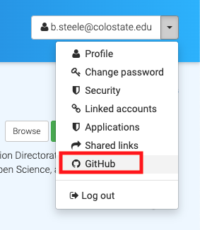
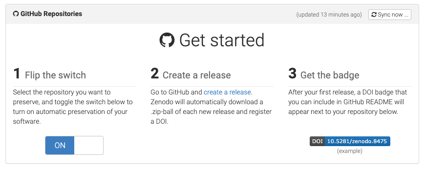

---
editor_options:
  markdown:
    wrap: 80
bibliography: references.bib
---

# Archiving Data and Code

We archive data and code through a number of pathways. Archiving our code and
data make downstream analyses reproducible, is a great way to share data, and
also provide the ability for citation through a stable DOI. Generally speaking,
it's good practice to get a DOI for any data before sharing it, as this helps
with data provenance, additionally, most journals now require that all code and
data are archived using a DOI. The flowchart below will guide you in the
preferred method of archiving.


## Choosing a data repository

The decision of which data repository to use is less straight forward. There
are benefits and trade-offs to each. The [Environmental Data Initiative
(EDI)](https://portal.edirepository.org/nis/home.jsp) requires a significant
amount of metadata in the form of an EML (ecological metadata language) file
that describes the data and is the best for .csv files, however, this metadata
makes the data more usable by downstream users.
[HydroShare](https://www.hydroshare.org/landingPage/) features a less rigid
metadata requirements, and is better suited for rasterized data and non-.csv
file types. [FigShare](https://figshare.com/) requires no metadata and because
of that there are numerous data products with no metadata that are stored on
FigShare.

Generally speaking, all data that is published from this lab should have
thorough metadata regardless of the metadata requirements of the data
repository chosen. For one-time uploads to EDI, you can use the
[ezEML](https://ezeml.edirepository.org/eml/auth/login) interface of EDI to
create and format your EML. If you plan to create many data packages, make an
EDI account so that you can upload yourself. If you have a dataset that will be
updated frequently, use of the R package
[{EMLassemblyline}](https://ediorg.github.io/EMLassemblyline/articles/overview.html)
is useful. If creating metadata for other data repositories, review the
[content of the
EML](https://github.com/EDIorg/MetadataTemplates/blob/master/EDI_metadata_template.docx)
and include as much of that information in your metadata as possible.

## Publishing code to Zenodo

When delivering code or repositories to our stakeholders or other researchers,
it needs to be citable. A citable repository has a stable DOI (digital object
identifier) and complete metadata. We use the GitHub integration in Zenodo to
publish repositories. When set up correctly, a GitHub 'release' will push all
code to Zenodo automatically. All future 'releases' will be associated with the
original DOI as well as a new DOI specific to that release.

In general, the GitHub -\> Zenodo pathway is best for software (code) and not
necessarily for data. Data publishing should be completed at EDI, CUAHSI, or
FigShare. Derived data is okay in the GitHub -\> Zenodo pathway, just remember,
this pathway is meant to be for CODE and SOFTWARE, not necessarily for data
(though you can publish data to Zenodo).

As mentioned before, we only publish repositories that have been consistently
reviewed internally. Ideally your repository has been reviewed by an external
collaborator or by another ROSSyndicate member. Remember, by pushing this
repository to Zenodo, you are creating a PERMANENT archive of its contents, for
better or worse.

### Creating a Zenodo account

The easiest way to create a Zenodo account is to do so with your GitHub
credentials. You will need to link these two accounts in order to fully take
advantage of the GitHub/Zenodo integration.

{width="1000"}

### Preparing to publish

In order to have a meaningful repository release, you need to provide some
metadata to Zenodo. While there are no requirements for publishing to Zenodo,
it is a best practice to include robust metadata alongside your code release. A
metadata template can be found in the helpful_docs folder of this repository.

Once you've compiled this information, send it to Katie Willi or Anika Pyle for
proofreading.

**Release Title**

You can use the repository name, but that's not going to be helpful for anyone
except you! Someone reading the Release Title should be able to discern what
the repository does. You can explain the 'how' in the description.

**Author list**

Prepare your author list by looking at the contributors to the repo. All
contributors to the repo should be listed as an author. You will need each
author's full name, institution, and their [ORCID](https://orcid.org/).

**Description**

This is the big lift in creating the metadata. Consider this similar to the
introduction/background and methods section of a scientific paper. In the
description of your repository, add information about the following things:

-   General code description - the 'how' of your repository

-   Methodology (summary only) - specifically if there are multiple steps to an
    analysis it is helpful to provide a methodology. If the repository hosts a
    very complicated analysis, consider only a condensed version of methods
    here, but add a markdown document with the complete methodology in your
    repository.

-   If you are including data:

    -   data lineage (aka, where the data came from)

    -   explanation of how the data have been manipulated if they are derived
        (this is related to methods, so use your best judgement).

-   If the analysis is specific to a certain locale, state and describe the
    locale.

-   Maintenance and maintenance interval. 'Ongoing' or 'completed'. If
    'ongoing', state the approximate interval that the repository will be
    updated.

-   If this is an update to a previous release, state the changes from the
    previous version.

Generally speaking, much of this information should already exist in your
repository README or Methods document and cutting/pasting is absolutely okay.
This section may be lengthy and that is okay!

**Version**

For one-time releases (like preparing a repository for a paper), using a
version-number is perfect (i.e. v1, v2, etc). For repositories that are updated
frequently, consider using a version-year-number (i.e. v2022-1, v2023-1,
v2023-2, etc).

**Keywords**

Generally speaking, keywords help others find your code or research. It is not
required. Keywords should be meaningful and specific and can include places,
methods, etc. It is common to use controlled vocabulary for keywords, like the
[LTER controlled vocabulary for ecology
research](https://vocab.lternet.edu/vocab/vocab/index.php).

**License**

All repositories that are published are considered open access. Because our
repository best practices include using an MIT use license, the LICENSE.txt
file will override this option.

**Funding**

If there is applicable funding sources for this repository, you should list
them. You will need the funder name and the grant number.

**No other fields are required.**

### Linking a repository to Zenodo

To activate the GitHub/Zenodo integration for a given repository, navigate to
the GitHub account page by clicking the dropdown menu in the top right of the
window.

{width="200"}

From here, you simply follow the directions!



### Completing the metadata information

To complete the entry of your metadata information and formalize the publishing
of your repository, you'll need to edit the Zenodo upload. Do this by clicking
on "My Dashboard".

Here, you can click on the released repository:


And then click the 'Edit' button for the associated upload. Here, you can enter
in all information from your Zenodo metadata document. When you're ready, press
'Save' and then 'Publish'.

### Add the DOI badge to your repository

Now that you've minted a sweet sweet DOI for your repository, you should go
ahead and add the DOI badge to your repository's README file.

On the right hand side of your Zenodo release landing page (formatted as
'<https://zenodo.org/record/*DOInumber>\*' on your browser), click on the DOI
badge:


This will pop up a number of embedding formats. Copy and paste the one for
'Markdown'. At this point, go to the GitHub repository and add the badge at the
top of the primary README file within the GitHub user interface on the web.
This addition to the repository does not need to be reviewed.

## Philosophical and Ethical Considerations

As a general philosophy we acknowledge that there is bias in every data set and
in the decisions we make along the way as we code. These biases may be
geographical (data are only from one location), contextual (data are only from
a single source), or implicit (data have been altered for a specific purpose).
As you prepare your data and metadata, it is important to think about the
biases we contribute to a given dataset.

To familiarize yourself with bias that we introduce into our data and analyses,
here are some resources:

-   "Biases in lake water quality sampling and implications for macroscale
    research" [@stanley2019]

-   [Review the questions in this
    datasheet](https://github.com/dmhuehol/Datasheets-for-Earth-Science-Datasets/blob/main/blank_EarthScienceDatasheet.pdf)
    created by our colleagues in the Atmospheric Sciences department when
    creating metadata and general documentation

-   A deep dive into bias in AI/ML: "Why we need to focus on developing ethical,
    responsible, and trustworthy artificial intelligence approaches for
    environmental science" [@mcgovern2022]

```{r, echo = F}
knitr::wrap_rmd('07-Publishing-Data-Code.Rmd', width = 80, backup = NULL)
#note, this will not wrap text that are prefaced by any special characters (like bullets!)
```
